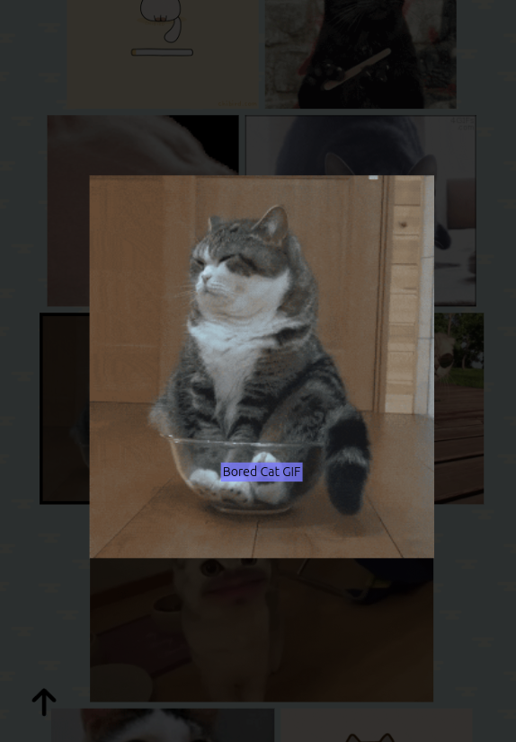

# Giphy Web App

This project uses: 
- Axios to fetch data from an api and display it in a UI
- React hooks such as useState and useEffect
- React testing library
- Passing props to child components

# Install
Clone the Repo
```bash
git clone https://github.com/AlexPBradley/giphy-web-app.git
```
Install dependencies
```bash
npm install
```
Run App
```bash
npm start
```
Check tests
```bash
npm test
```

# Use
See trending Gifs dislpayed on https://giphy.com/ or search to see your favorites.




